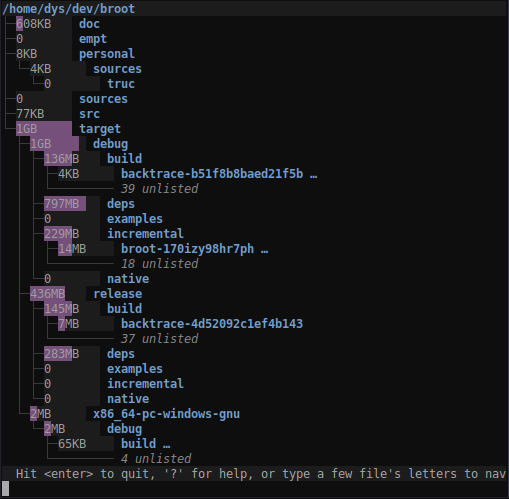
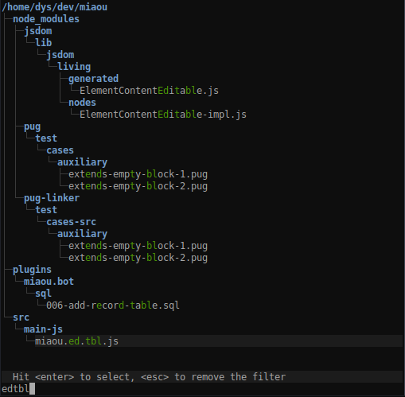

# Broot (pronounce "b-root")

A interactive tree view, a fuzzy search, a balanced BFS descent and customizable commands.

Get an overview of a directory, even a big one:

See what takes space:

Never lose track of file hierarchy while you fuzzy search:

Apply a personal shorcut to a file:

And everything's blazingly fast and nothing never blocks:

## Installation

### From Source

You'll need to have the Rust development environment installed.

Fetch the Canop/broot repository, move to the broot directory, then run

    cargo build --release

The executable is written in the `target/release` directory.

### From up to date precompiled binaries

* [x86_64-linux](https://dystroy.org/broot/x86_64-linux/broot)

## Development

To ease tests during development, a log file can be generated (and followed using tail -f) by using the BROOT_LOG env variable.

For example:

    BROOT_LOG=debug cargo run

If you want to discuss the code or features of broot, please come to [our chat](https://miaou.dystroy.org/3?Code_et_Croissants). If you'd like a new feature, don't hesitate to ask for it.
