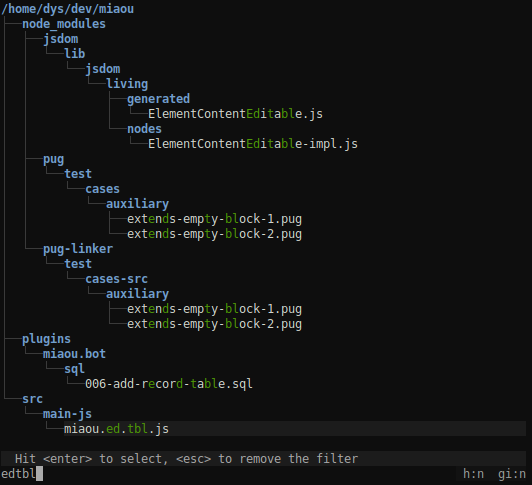

# Broot (pronounce "b-root")

A better way to navigate directories.

### Get an overview of a directory, even a big one:

Notice the "unlisted" ? That's what makes it usable where the old `tree` command would produce pages of output.

.gitignore files are properly dealt with to put unwanted files out of your way (you can ignore them, though, see documentation).

### Find a directory then `cd` to it:

You can this way navigate to a directory with the minimum amount of keystrokes, even if you don't exactly remember where it is.

broot is fast and never blocks, even when you make it search a big slow disk (any keystroke interrupts the current search to start the following one).

Most useful keys for this:

* the letters of what you're looking for
* `<enter>` to select a directory (staying in broot)
* `<esc>` to get back to the previous state or clear your search
* `:c` to get back to the shell having cd to the selected directory ([see below](#use-broot-for-navigation))
* `:q` if you just want to quit (`<esc>` works too)

### Never lose track of file hierarchy while you fuzzy search:

broot tries to select the most relevant file. You can still go from one match to another one using `<tab>` or arrow keys.

You may also search with a regular expression. To do this, add a `/` before or after the pattern.

Complex regular expression are possible, but you'll probably most often use a regex to do an "exact" search, or search an expression at the start or end of the filename.

For example, assuming you look for your one file whose name contains `"abc"` in a big directory, you may not see it immediately because of many fuzzy matches. In that case, just add a slash at the end to change you fuzzy search into an exact expression: `abc/`.

And if you look for a filename *ending* in `"abc"` then you may anchor the regex: `abc$/`.

### See what takes space:

To toggle size display, you usually hit `:s`. Sizes are computed in the background, you don't have to wait for them when you navigate.

### Apply a personal shorcut to a file:

Just find the file you want to edit with a few keystrokes, type `:e`, then `<enter>` (you should define your prefered editor, see [documentation](documentation.md#verbs)).

### More...

See the complete [Documentation](documentation.md).

## Installation

### From Source

You'll need to have the [Rust development environment](https://www.rust-lang.org/tools/install) installed.

Fetch the Canop/broot repository, move to the broot directory, then run

    cargo build --release

The executable is written in the `target/release` directory (you might want to move it to your `/usr/bin`, or to add the release directory to your path).

### From up to date precompiled binaries

* [x86_64-linux](https://dystroy.org/broot/x86_64-linux/broot)

## cd

broot is convenient to find a directory then `cd` to it. The `c` command of the default configuration is here for this purpose.

But broot needs a companion function in the shell in order to be able to change directory. To enable this feature, add this to your `.bashrc` (or the relevant file for another shell):

	# start broot and let it change directory
	function br {
	    f=$(mktemp)

	    (
		set +e
		broot --out "$f" "$@"
		code=$?
		if [ "$code" != 0 ]; then
		    rm -f "$f"
		    exit "$code"
		fi
	    )
	    code=$?
	    if [ "$code" != 0 ]; then
		return "$code"
	    fi

	    d=$(cat "$f")
	    rm -f "$f"

	    if [ "$(wc -c <(echo -n "$d") | head -c1)" != 0 ]; then
		cd "$d"
	    fi
	}

(you'll have to source the file or open a new terminal)

With this addition, you can do just `br` to lauch broot, and typing `:c` then *enter* will cd for you. You can search and change directory in one command: `mylosthing:c`.

## Development

To ease tests during development, a log file can be generated (and followed using tail -f) by using the BROOT_LOG env variable.

For example:

    BROOT_LOG=debug cargo run

or

    BROOT_LOG=info cargo run

If you want to discuss the code or features of broot, please come to [our chat](https://miaou.dystroy.org/3?Code_et_Croissants). Before to start coding for a PR, it would really be a good idea to come and talk about it.

If you'd like a new feature, don't hesitate to ask for it.
