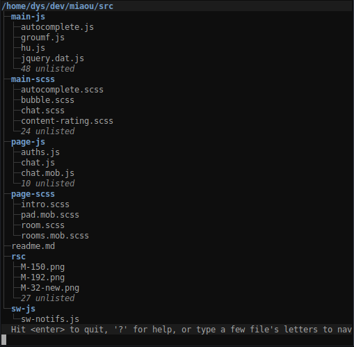
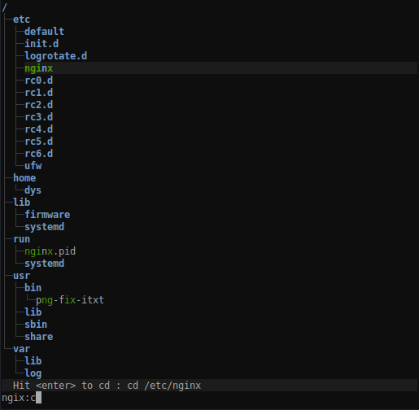
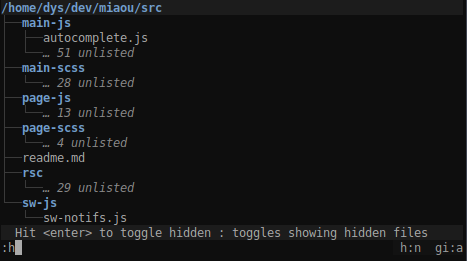

# Broot (pronounce "b-root")

An interactive tree view, a fuzzy search, a balanced BFS descent and customizable commands.

Get an overview of a directory, even a big one:

Find a directory then `cd` to it:

See what takes space:

Never lose track of file hierarchy while you fuzzy search:

Apply a personal shorcut to a file:

broot is fast and never blocks, even when you make it search a big slow disk.

## Usage

### General Usage

Launch it (see `broot --help` for launch options).

Type a few letters to fuzzy search files or directories.

Enter brings you to a directory or opens a file.

A command starts with a space or `:` (as you like) and is usually only one letter (for example `:s` to toggle sizes, `:q` to quit, `:p` to go up the tree, etc.).

Type `?` to see the list of commands and the path to their configuration.

At any time the `esc` key brings you to the previous state.

### Use broot to see directory sizes

You can either start broot normally then type `:s` which toggles size display, or start broot with

    broot --sizes

You might prefer to hide non directory files while looking at sizes. Use `:f` to show only folders.

### Use broot for navigation

broot is convenient to find a directory then `cd` to it. The `c` command of the default configuration is here for this purpose.

But broot needs a companion function in the shell in order to be able to change directory. To enable this feature, add this to your `.bashrc` (or the relevant file for another shell):

	# start broot and let it change directory
	function br {
	    f=$(mktemp)

	    (
		set +e
		broot --out "$f" "$@"
		code=$?
		if [ "$code" != 0 ]; then
		    rm -f "$f"
		    exit "$code"
		fi
	    )
	    code=$?
	    if [ "$code" != 0 ]; then
		return "$code"
	    fi

	    d=$(cat "$f")
	    rm -f "$f"

	    if [ "$(wc -c <(echo -n "$d") | head -c1)" != 0 ]; then
		cd "$d"
	    fi
	}

(you'll have to source the file or open a new terminal)

With this addition, you can do just `br` to lauch broot, and typing `:c` then *enter* will cd for you. You can search and change directory in one command: `mylosthing:c`.

You can still use broot normally, you won't change directory if you don't hit `:c`.

## Flags

Flags are displayed at the bottom right, showing the settings regarding hidden files and .gitignore rules.

### Git Repositories

.gitignore files are parsed and used depending on the current "gitignore" setting:

* when "no", .gitignore files are ignored
* when "yes", each directory is filtered according to the applied gitignore files (several git repositories may be simultaneously shown)
* when "auto" (default value), gitignore rules are ignored unless the root directory is a git repository or inside one

## Installation

### From Source

You'll need to have the Rust development environment installed.

Fetch the Canop/broot repository, move to the broot directory, then run

    cargo build --release

The executable is written in the `target/release` directory.

### From up to date precompiled binaries

* [x86_64-linux](https://dystroy.org/broot/x86_64-linux/broot)

## Development

To ease tests during development, a log file can be generated (and followed using tail -f) by using the BROOT_LOG env variable.

For example:

    BROOT_LOG=debug cargo run

If you want to discuss the code or features of broot, please come to [our chat](https://miaou.dystroy.org/3?Code_et_Croissants). If you'd like a new feature, don't hesitate to ask for it.
