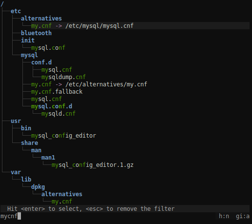
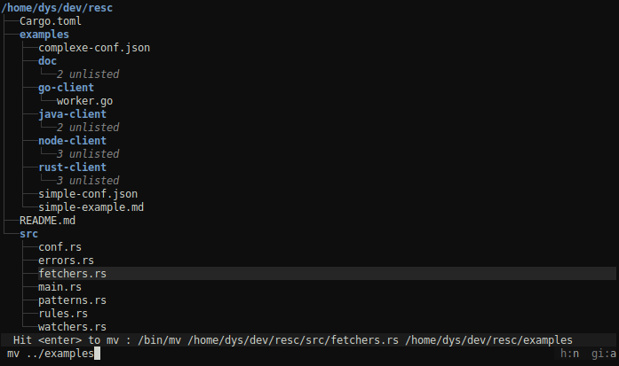
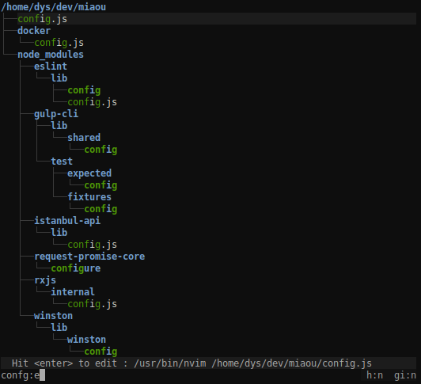

# Get an overview of a directory, even a big one

Notice the "unlisted"? That's what makes it usable where the old `tree` command would produce pages of output.

`.gitignore` files are properly dealt with to put unwanted files out of your way (you can ignore them though, see documentation).

# Find a directory then `cd` to it

This way, you can navigate to a directory with the minimum amount of keystrokes, even if you don't exactly remember where it is.

broot is fast and never blocks, even when you make it search a big slow disk (any keystroke interrupts the current search to start the next one).

Most useful keys for this:

* the letters of what you're looking for
* `<enter>` to select a directory (staying in broot)
* `<esc>` to get back to the previous state or clear your search
* `<alt><enter>` to get back to the shell having `cd` to the selected directory
* `:q` if you just want to quit (`<esc>` works too)

# Never lose track of file hierarchy while you search

broot tries to select the most relevant file. You can still go from one match to another one using `<tab>` or arrow keys.

You may also search with a regular expression. To do this, add a `/` before or after the pattern.

Once the file you want is selected you can

* hit `<enter>` (or double-click) to open it in your system's default program
* hit `<alt><enter>` to open it in your system's default program and close broot
* type a verb. For example `:e` should be configured to open the file in your preferred editor (which may be a terminal one)

# Manipulate your files

Most often you move your files in the blind. You do a few `ls` before, then your manipulation, and maybe you check after.

You can instead do it without losing the view of the file hierarchy.

Move, copy, rm, mkdir, are built in and you can add your own shortcuts.

# Apply a personal shortcut to a file

Just find the file you want to edit with a few keystrokes, type `:e`, then `<enter>` (you should define your preferred editor, see [documentation](documentation/usage.md#verbs)).

### See what takes space:

If you start broot with the `--sizes` option, you get a mode tailored to "whale spotting" nagigation, making it easy to determine what files or folders take space.

And you keep all broot tools, like filtering or the ability to delete or open files and directories.

Sizes are computed in the background, you don't have to wait for them when you navigate.

# More...

See the complete [Documentation](documentation/usage.md).

